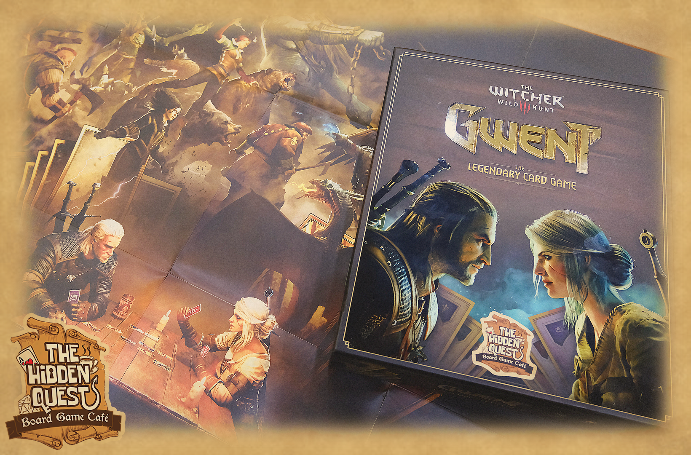
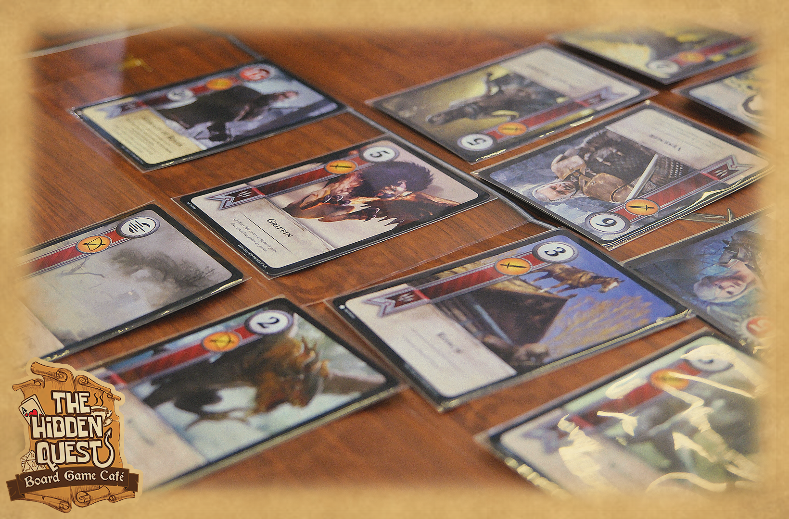
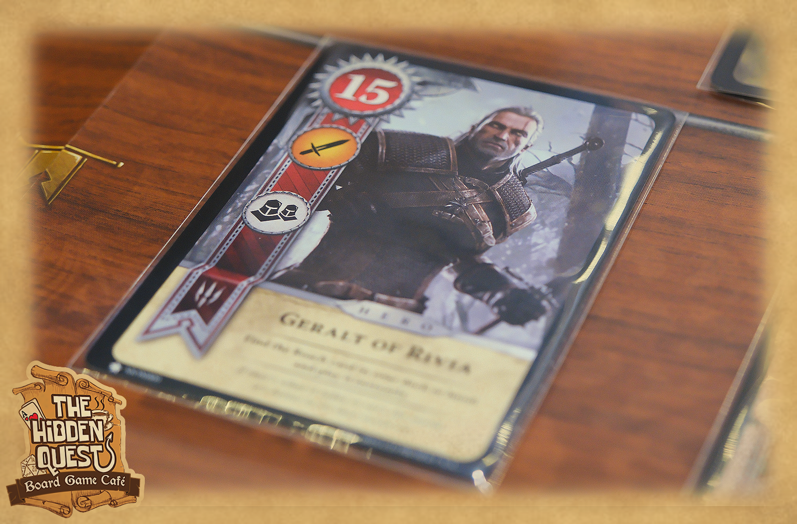

> [!infobox]
>
> # **Gwent**
>
> /pic8954964.png)
>
> # _**Detail**_
>
> |  |  |
> | :----: | :----: |
> | **Level** | 2 |
> | **Genres** | Card game |
> | | Deck building |

"Chơi Gwent không nào?"

 Hỡi các Witcher, tựa game Gwent huyền thoại đã có mặt ở quán, sẵn sàng cho những trận bài hấp dẫn. Hãy tới quán để thành những tay bài Gwent giỏi nhất vùng!!!

 Chỉ với 89k/người bạn sẽ đc chơi thoả thích tới 4 tiếng bao gồm 1 ly nước từ menu

> [!grid|left]
> 
>
> 
>
> 
